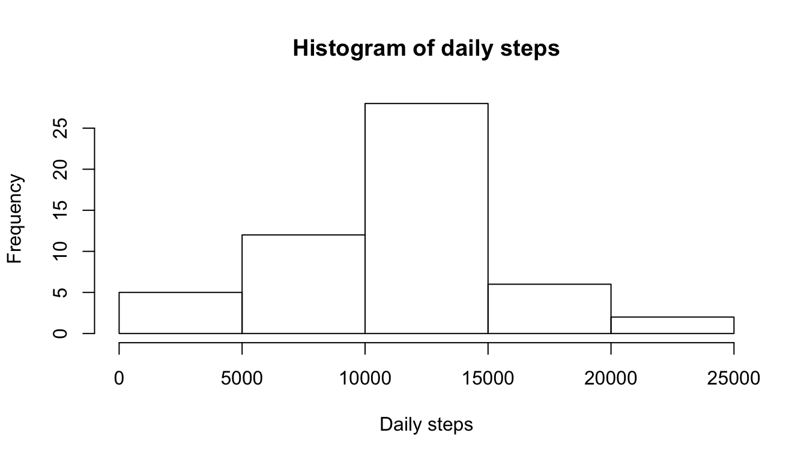
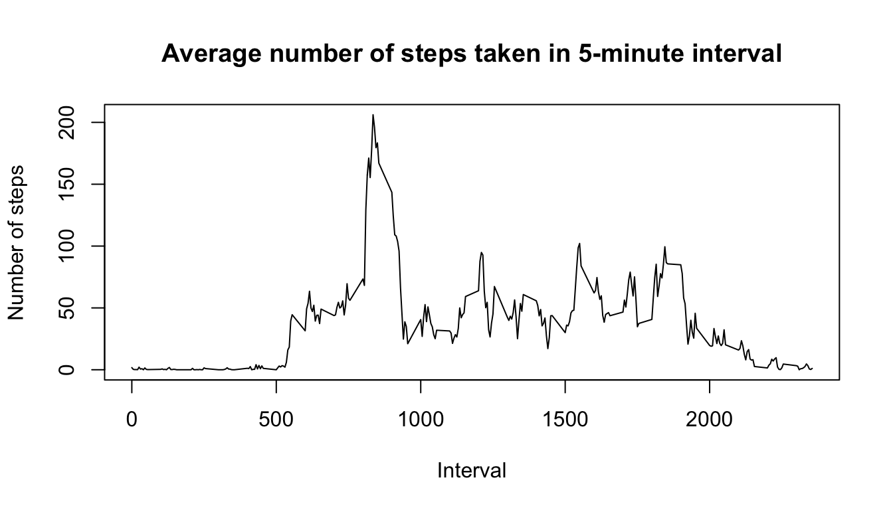
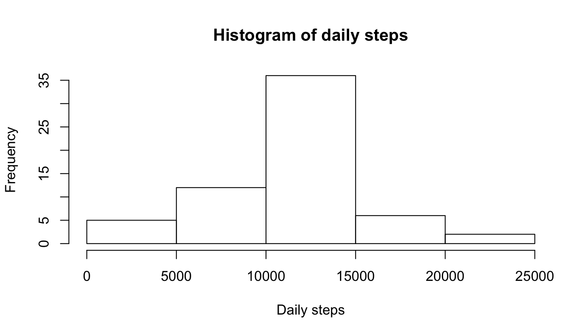
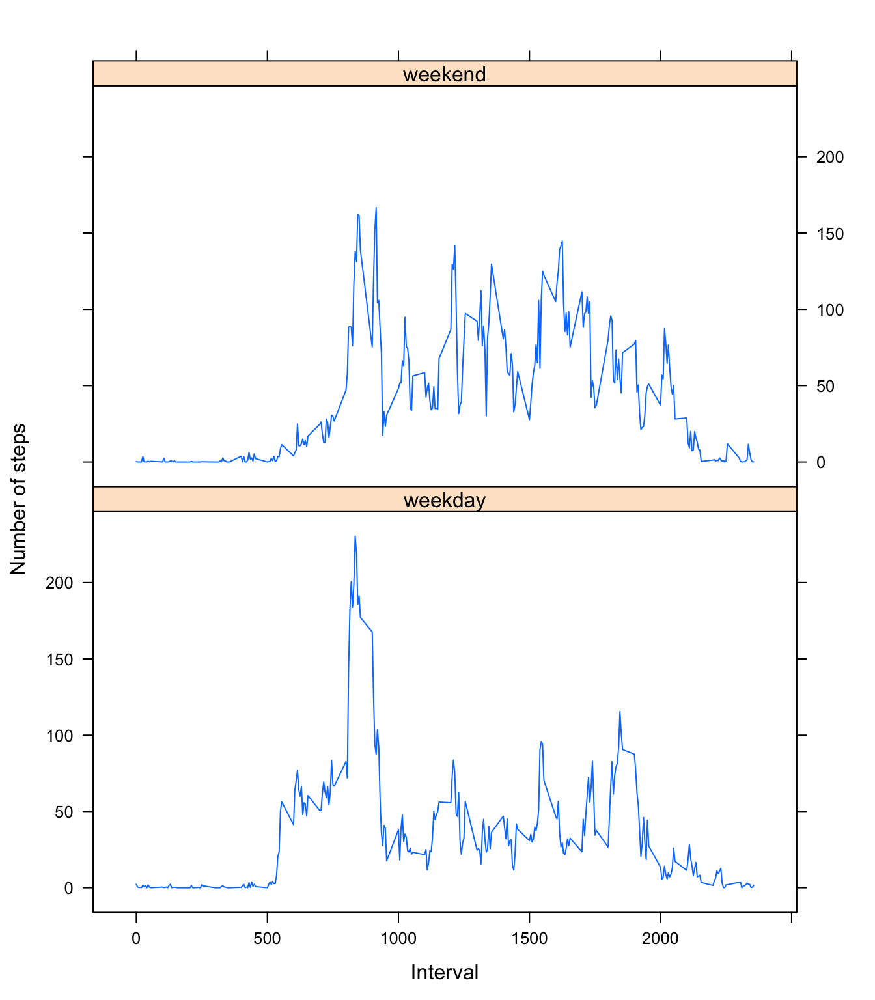

# Reproducible Research: Peer Assessment 1

*Created by Jianfa Chen on 7/22/2016.* 

*Copyright @ Jianfa Chen. All rights reserve.*

## output: 
  html_document: **PA1_template.Rmd**
  
keep_md: true
    
    
---
## Set default option of echo to TRUE

```r
knitr::opts_chunk$set(echo = TRUE)
```

## Loading data and processing data
1. Load data

```r
url <- "https://github.com/jianfa/RepData_PeerAssessment1/raw/master/activity.zip"
download.file(url,"./activity.zip")
activity <- read.table(unz("activity.zip","activity.csv"),sep=",",header = TRUE,na.strings = "")
```

2. Summary data

```r
summary(activity)
```

```
##      steps               date          interval     
##  0      :11014   2012-10-01:  288   Min.   :   0.0  
##  NA     : 2304   2012-10-02:  288   1st Qu.: 588.8  
##  7      :   87   2012-10-03:  288   Median :1177.5  
##  8      :   83   2012-10-04:  288   Mean   :1177.5  
##  15     :   68   2012-10-05:  288   3rd Qu.:1766.2  
##  16     :   65   2012-10-06:  288   Max.   :2355.0  
##  (Other): 3947   (Other)   :15840
```

3. Check the detail of data

```r
str(activity)
```

```
## 'data.frame':	17568 obs. of  3 variables:
##  $ steps   : Factor w/ 618 levels "0","1","10","100",..: 618 618 618 618 618 618 618 618 618 618 ...
##  $ date    : Factor w/ 61 levels "2012-10-01","2012-10-02",..: 1 1 1 1 1 1 1 1 1 1 ...
##  $ interval: int  0 5 10 15 20 25 30 35 40 45 ...
```

4. Take a look at the data

```r
head(activity)
```

```
##   steps       date interval
## 1    NA 2012-10-01        0
## 2    NA 2012-10-01        5
## 3    NA 2012-10-01       10
## 4    NA 2012-10-01       15
## 5    NA 2012-10-01       20
## 6    NA 2012-10-01       25
```

5. We find that the class of steps and date are factors, required to be converted into numeric and date format, respectively.

```r
activity$steps <- as.numeric(levels(activity$steps))[activity$steps]
```

```
## Warning: NAs introduced by coercion
```

```r
activity$date <- as.Date(activity$date)
```

   Now the class of data has correct formats.

```r
str(activity)
```

```
## 'data.frame':	17568 obs. of  3 variables:
##  $ steps   : num  NA NA NA NA NA NA NA NA NA NA ...
##  $ date    : Date, format: "2012-10-01" "2012-10-01" ...
##  $ interval: int  0 5 10 15 20 25 30 35 40 45 ...
```


## What is mean total number of steps taken per day?

1. Calculate the total number of steps taken per day


```r
dailystep <- with(activity,tapply(steps,date,sum,na.rm=TRUE ))
```
**The value of dailystep is 0 for NA days, which should be remove when plot figures and calculate mean and median.**

2. Make a histogram of total number of steps taken each day


```r
hist(dailystep[dailystep!=0],main = "Histogram of daily steps", xlab = "Daily steps")
```



3. Calculate and report the mean and median of the total number of steps taken per day


   
   The mean of daily step is **10766.19**, and the median daily step is **10765.00**.

## What is the average daily activity pattern?

1. Make a time series plot (i.e. 𝚝𝚢𝚙𝚎 = "𝚕") of the 5-minute interval (x-axis) and the average number of steps taken, averaged across all days (y-axis)


```r
intervalavg <- with(activity,tapply(steps,interval,mean,na.rm=TRUE ))
plot(names(intervalavg),intervalavg,type = "l",xlab = "Interval", ylab = "Number of steps",
     main = "Average number of steps taken in 5-minute interval")
```



   

2. Which 5-minute interval, on average across all the days in the dataset, contains the maximum number of steps?


```r
maxstepinterval <- names(which(intervalavg == max(intervalavg, na.rm = TRUE)))
```

   The 5-minute interval contains the maximum number of steps is on **835**.

## Imputing missing values
1. Calculate and report the total number of missing values in the dataset (i.e. the total number of rows with 𝙽𝙰s)


    
    The total number of missing value in the dataset is **2304**.

2. Devise a strategy for filling in all of the missing values in the dataset. The strategy does not need to be sophisticated. For example, you could use the mean/median for that day, or the mean for that 5-minute interval, etc.


```r
Naindex <- is.na(activity$steps)
activity$steps[Naindex] <- intervalavg[as.character(activity$interval[Naindex])]
```

   *Use the mean for 5-minute interval value for the missing value.*

3. Create a new dataset that is equal to the original dataset but with the missing data filled in.

   **This is done in last step.**

4. Make a histogram of the total number of steps taken each day and Calculate and report the mean and median total number of steps taken per day. Do these values differ from the estimates from the first part of the assignment? What is the impact of imputing missing data on the estimates of the total daily number of steps?


```r
dailystep2 <- with(activity,tapply(steps,date,sum,na.rm=TRUE ))
hist(dailystep2,main = "Histogram of daily steps", xlab = "Daily steps")
```



```r
meanstep2 <- format(mean(dailystep2),nsmall = 2)
medianstep2 <- format(median(dailystep2),nsmall=2)
```
   
   The mean total number os steps taken per day is **10766.19**, and the median is **10766.19**. Mean value keep the same, which median value increase from **10765.00** to **10765.00**. After imputing missing data, the distrubute of mean daily steps increases.
   
## Are there differences in activity patterns between weekdays and weekends?
1. Create a new factor variable in the dataset with two levels – “weekday” and “weekend” indicating whether a given date is a weekday or weekend day.


```r
activity$weekday <- as.character(weekdays(activity$date))
weekday <- c("Monday", "Tuesday", "Thursday", "Wednesday", "Friday")
weekend <- c("Saturday", "Sunday")
activity$weekday[activity$weekday %in% weekday] <- "weekday"
activity$weekday[activity$weekday %in% weekend] <- "weekend"
activity$weekday <- as.factor(activity$weekday)
```


2. Make a panel plot containing a time series plot (i.e. 𝚝𝚢𝚙𝚎 = "𝚕") of the 5-minute interval (x-axis) and the average number of steps taken, averaged across all weekday days or weekend days (y-axis). See the README file in the GitHub repository to see an example of what this plot should look like using simulated data.


```r
library(lattice)
intervalavg2 <- aggregate(steps ~ interval + weekday,data = activity,mean)
xyplot(steps ~ interval | weekday, index.cond=list(c(1,2)),data=intervalavg2,xlab = "Interval", ylab = "Number of steps",layout=c(1,2),type="l")
```


